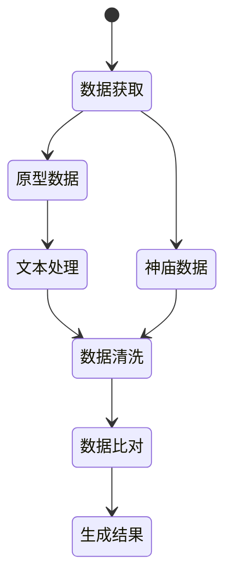

通过Python数据分析王国之泪中神庙的现实原型


<!-- more -->


## 介绍

本篇是对塞尔达传说：王国之泪中破魔神庙的现实原型进行研究，灵感来源B站[Gu-Utd](https://space.bilibili.com/1583595718)大佬的[视频](https://www.bilibili.com/video/BV1qh4y1R7nU)

旨在通过信息化手段进行研究， 使用Python编写分析程序，对原始数据清洗、过滤和转换后，与游戏数据进行匹配，最后根据相似度判断出可能性最高的现实原型。


## 研究思路




## 研究步骤

### 安装依赖
httpx:  爬虫异步请求
posuto： 日本邮编查询地区
pykakasi： 汉字假名转换
pandas： 处理表类数据

### 爬取数据

在各种官方网站查找，大部分数据都嵌入到了HTML中，返回的结果也不太容易处理

最后在搜索景点时，锁定了[いつもNAVI](https://www.its-mo.com/)这家导航网站, 以下简称`一导网`

#### 全量数据

京都府全量数据高达**130524件**

[京都府の全ジャンル　1ページ目 | いつもNAVI (its-mo.com)](https://www.its-mo.com/pois/26/)


#### 景点数据

景点数据大概5000个，数量少很多了，就以此来爬取

[京都府のレジャー・観光・スポーツ　1ページ目 | いつもNAVI (its-mo.com)](https://www.its-mo.com/pois/26/?genrecode=0200000000)


#### 编写爬虫程序

以景点为例，爬取所有页面上的数据

选择这个网站的好处就是，它返回的数据为`JSON`格式，方便编程语言调用和数据处理

这里分析数据包，标准的接口请求，直接照搬即可，不用设置`Cookies`

具体爬虫分析和编写不做演示了


变量为`页码`和`页码数`,这里怕有限制直接没用异步了，完整代码如下

获取京都全量数据未演示，也是同理

```python
import httpx
import math

def get_sights(page_index:int=0, page_size:int=100):
    """爬取景点数据"""
    headers = {
        'authority': 'webapi.its-mo.com',
        'accept': 'application/json, text/plain, */*',
        'accept-language': 'zh-CN,zh;q=0.9,en;q=0.8,en-GB;q=0.7,en-US;q=0.6',
        #'if-none-match': 'W/"2734a-Nvyv8016ajHuxDUWfPl1/jG4Bkg"',
        'origin': 'https://www.its-mo.com',
        'referer': 'https://www.its-mo.com/',
        'sec-ch-ua': '"Not.A/Brand";v="8", "Chromium";v="114", "Microsoft Edge";v="114"',
        'sec-ch-ua-mobile': '?0',
        'sec-ch-ua-platform': '"Windows"',
        'sec-fetch-dest': 'empty',
        'sec-fetch-mode': 'cors',
        'sec-fetch-site': 'same-site',
        'user-agent': 'Mozilla/5.0 (Windows NT 10.0; Win64; x64) AppleWebKit/537.36 (KHTML, like Gecko) Chrome/114.0.0.0 Safari/537.36 Edg/114.0.1823.51',
    }
    page_index = str(page_index)
    page_size = str(page_size)
    response = httpx.get(
        f'https://webapi.its-mo.com/poi?content=EKI_JRD,DIDX_EKI,DIDX_DKE,DIDX_ZPOI,ZIDX_BLD,KNK_ZPOI,KNK_CAMP,HTL_RKT,RTC_RKT,PAC_PWORLD,PPK_ZPOI,PPK_PARK,PPK_REPARK,PPK_AKP,GLF_RKT,GS_GOGO,WP_ORBIS,LOC_AED,RS_ADEOS,LCF_ADEOS,PPK_MKS2,GRM_GNAVI&addrcode=26&facet=tod,shk,oaz,gnrnm&sort=%2Bdist,-fmsth,-fmnm,-pscore,ckbn&limit={page_index},{page_size}&exclude_link=T&genrecode=0200000000',
        headers=headers,
    )
    return response.json()


def get_index(total:int, page_size:int):
    """生成页码"""
    size = math.ceil(total/page_size) 
    ls = [ 0 + i * page_size for i in range(size)]
    return ls

def get_all_sights(total = 4982, page_size=100):
    """获取所有景点数据"""
    ls = get_index(total,page_size)
    sights = []
    for page_index in ls:
        try:
            sights_raw = get_sights(page_index,page_size)
        except Exception as err:
            print('Error: request fail@' + err)
            sights_raw = {}
        
        sights.extend(sights_raw.get('item',[]))

    return sights

sights = get_all_sights(4982,100)

```

#### 数据分析

返回数据为`字典列表list[dict]`,截取其中一个展示

```json
    {
        "angle": 0,
        "text": "清水寺",
        "code": "3757400",
        "point": {
            "lat": "34.9916083",
            "lon": "135.7877917"
        },
        "distance": "",
        "kana": "キヨミズデラ",
        "addressText": "京都府京都市東山区清水１丁目２９４",
        "zipcode": "605-0862",
        "phoneNumber": [
            "075-551-1234"
        ],
        "content": "DIDX_DKE",
        "todcode": "26",
        "todname": "京都府",
        "shkname": "京都市東山区",
        "shkcode": "105",
        "oazcode": "071",
        "oazname": "清水１丁目",
        "catId": "01:20301030000;02:3210000",
        "iareacode": "14905",
        "iareaname": "祇園・東山",
        "diareacode": "26-a14905",
        "diareaname": "洛東・祇園・東山・銀閣寺",
        "fmnmFlag": "",
        "fmthFlag": "",
        "mscore": "",
        "link01": {
            "kbn": "KNK_ZPOI",
            "id": "J00000000000A3701470",
            "nm": "清水寺",
            "kn": "キヨミズデラ",
            "addr": "京都府京都市東山区清水１丁目２９４",
            "telno": "075-551-1234",
            "ctchcpy": "音羽山の険しい山腹にある「清水の舞台」",
            "image_url": "https://imgcache.its-mo.com/contents/KNK_ZPOI/J00000000000A3701470/003137477-1/003137477-1_m.jpg",
            "hours": "06:00-18:00",
            "holiday": "年中無休"
        },
        "link02": "",
        "link03": "",
        "link04": "",
        "link05": "",
        "link06": "",
        "link07": "",
        "link08": "",
        "link09": "",
        "link10": "",
        "eki_info": {
            "name": "清水五条",
            "code": "5301",
            "distance": "1456"
        },
        "genreText": "寺院・神社・神宮",
        "genreCode": "020010001k",
        "smallGenre": {
            "code": "0200000000:0200100000:020010001k",
            "text": "寺院・神社・神宮",
            "count": 2042
        },
        "middleGenre": {
            "code": "0200000000:0200100000",
            "text": "神社・寺・教会",
            "count": 2363
        },
        "bigGenre": {
            "code": "0200000000",
            "text": "レジャー・観光・スポーツ",
            "count": 4982
        },
        "content_data": {
            "isMidnightOpen": false,
            "opentime": "06:00-18:00",
            "holiday": "年中無休",
            "links": [
                "KNK_ZPOI"
            ],
            "linkContents": [
                {
                    "kbn": "KNK_ZPOI",
                    "id": "J00000000000A3701470",
                    "nm": "清水寺",
                    "kn": "キヨミズデラ",
                    "addr": "京都府京都市東山区清水１丁目２９４",
                    "telno": "075-551-1234",
                    "ctchcpy": "音羽山の険しい山腹にある「清水の舞台」",
                    "image_url": "https://imgcache.its-mo.com/contents/KNK_ZPOI/J00000000000A3701470/003137477-1/003137477-1_m.jpg",
                    "hours": "06:00-18:00",
                    "holiday": "年中無休"
                }
            ]
        }
    },
```


### 检索数据

实际上在找数据网站爬取前，我先想到的是直接去Github上搜索

通过关键字检索，筛选条件文件格式设置为`JSON`或`CSV`


#### 关键字检索

通过将已破解出来的现实原型的名称进行搜索，可以找到比较多的数据文件

当然这种方法比较偷懒，优点是拿来即用，缺点是很多数据不完整或者用不上


#### 类型检索

通过对关键字的检索，可以分析总结出具体会有哪些类型相关的数据

例如：

清水寺 -> 寺庙 -> temple

那么检索`kyoto temple`就可以获取到同类型的数据

以此类推，最后找到对应类型的[原型数据](##原型数据)


### 数据清洗

尽管上述方法获取的数据结构、格式都有所不同，但好在我们只需要`名称`就足够了

结合`神庙名称`，我们需要将这些名称也转换为对应的`片假名`


#### 类名省略

现将现实原型的名称分析，可将它拆分成两部分，名称加类型

`清水寺 -> 清水 + 寺`

神庙就是根据名称变换而来，需要剔除掉类型，避免对后续的数据比对造成负面影响

```python
ddef extract_name(reality_name:str):
    """剔除类型名称"""
    ls = ['寺','御所','神社','駅','通','池','町','堂','宮','路','塚']
    for t in ls:
        split_ls = reality_name.split(t)
        reality_name = split_ls[0]
        break
    return reality_name
```

使用split()方法截取到类型前的名称，同时需要考虑类名是否对名称产生影响

例如，‘川’、‘橋’、‘院'这种可能包含在名称中的类型，视情况调整


#### 真假名转换

对于真名(日本汉字)转换为假名，直接在GitHub上找到了相关的包

[miurahr/pykakasi: Lightweight converter from Japanese Kana-kanji sentences into Kana-Roman. (github.com)](https://github.com/miurahr/pykakasi)

使用`pykakasi`可以将输入任何日语，转换成平假名、片假名和罗马音

```python
def kanji2katakana(kanji:str)->list:
    """汉字转片假名"""
    query =  kks.convert(kanji)
    katakana = ''
    for part in query:
        kana = part['kana']
        katakana += kana
    return katakana

#かな: kana 'カナ', hiragana: 'かな', romaji: 'kana'
#漢字: kana 'カンジ', hiragana: 'かんじ', romaji: 'kanji'
```


#### 变音统一

日语中存在浊音和半浊音，神庙名称也存在这种变形

因为可能存在双向的转换，这里统一将所有的变音转换为原音，不论是神庙还是现实原型

```
が -> か
Ga -> Ka
```

直接让ChatGPT帮忙写一个转换

```python
mapping_table = {
    'が': 'か', 'ぎ': 'き', 'ぐ': 'く', 'げ': 'け', 'ご': 'こ',
    'ざ': 'さ', 'じ': 'し', 'ず': 'す', 'ぜ': 'せ', 'ぞ': 'そ',
    'だ': 'た', 'ぢ': 'ち', 'づ': 'つ', 'で': 'て', 'ど': 'と',
    'ば': 'は', 'び': 'ひ', 'ぶ': 'ふ', 'べ': 'へ', 'ぼ': 'ほ',
    'ぱ': 'は', 'ぴ': 'ひ', 'ぷ': 'ふ', 'ぺ': 'へ', 'ぽ': 'ほ',
    'ガ': 'カ', 'ギ': 'キ', 'グ': 'ク', 'ゲ': 'ケ', 'ゴ': 'コ',
    'ザ': 'サ', 'ジ': 'シ', 'ズ': 'ス', 'ゼ': 'セ', 'ゾ': 'ソ',
    'ダ': 'タ', 'ヂ': 'チ', 'ヅ': 'ツ', 'デ': 'テ', 'ド': 'ト',
    'バ': 'ハ', 'ビ': 'ヒ', 'ブ': 'フ', 'ベ': 'ヘ', 'ボ': 'ホ',
    'パ': 'ハ', 'ピ': 'ヒ', 'プ': 'フ', 'ペ': 'ヘ', 'ポ': 'ホ',
}
def convert_to_original_sound(kana):
    original_kana = ''
    for char in kana:
        if char in mapping_table:
            original_kana += mapping_table[char]
        else:
            original_kana += char
    return original_kana
```

至此，数据清洗基本完成，下面就是进行相似度比对

### 数据比对


#### SequenceMatcher字符串相似度

对于相似度匹配，首先想到`difflib`

```
def diff_similarity(str1, str2):
    """difflib计算字符串相似度"""
    similarity = SequenceMatcher(None, str1, str2).ratio()
    return similarity
```

但这种方法是比较文本的距离，对于顺序变化字符串的识别度会造成误差


#### Jaccard顺序相似度

尝试问下GPT，它给出了一个比较合适的匹配方案


```python
def jaccard_similarity(str1, str2):
    """Jaccard算法顺序比较"""
    set1 = set(str1)
    set2 = set(str2)
    intersection = len(set1.intersection(set2))
    union = len(set1.union(set2))
    similarity = intersection / union
    return similarity
```


我们根据每种类型对所有神庙比较，按相似度最高的前n名生成结果

```python
def match(shrine_name:str,reality_data:list[dict], n:int=3, convert:bool=True):
    """匹配神庙和原型数据相似度
    Param:
        shrine - 神庙名称
        reality_data: 原型数据
        n: 选取最匹配的n个值"""
    
    # 相似度列表
    similarity_ls = []
    # 原型列表
    reality_ls = []

    for reality_name in reality_data:
      	
        reality_kata = reality_data[reality_name]
        # 比较相似度
        if convert:
            shrine_name = convert_to_original_sound(shrine_name)
            reality_kata = convert_to_original_sound(reality_kata)
        similarity = jaccard_similarity(shrine_name, reality_kata) 
        # reality_name['similarity'] = similarity
        reality = {
            'name': reality_name,
            'kata': reality_kata,
            'similarity': similarity
        }
        reality_ls.append(reality)
        similarity_ls.append(similarity)
    # 求最相似的n个值
    indixies = largest_indices(similarity_ls, n)
    result = []
    for i in indixies:
        result.append(reality_ls[i])

    return result

def get_match_result(shrine_ls, reality_data, n, data_type:str='station', rate:float=0.6):
    """获取匹配结果"""
    for shrine in shrine_ls:
        shrine_ja = shrine['ja']
        shrine_name = shrine_ja.replace('の祠','')
        result = match(shrine_name, reality_data, n)
        print(result)
        for i in range(len(result)):
            one = result[i]
            shrine.update({
                data_type+'_name'+str(i+1) : one['name'],
                data_type+'_kata'+str(i+1) : one['kata'],
                data_type+'_similarity'+str(i+1) : one['similarity'],
                data_type+'_match'+str(i+1) : bool( one['similarity'] >= rate)
            })
    return shrine_ls
```

由于不清楚老任选取名称的具体方向，数据越大覆盖面就越广，这样能提供参考的数据就越多。因此，选择了比较多的原型数据进行匹配，后续再进行人工过滤


## 结果分析

大部分地名可以做到较高的匹配度，基本可以锁定。

但在人工分析和汇总后，也发现存在一些问题


### 问题分析

1. 神庙叠词问题，少部分神庙存在单字重复的情况，例如`セパパ`、`ゲミミカ`、`マヤタタ`这种将一个假名重复一遍，会导致匹配度下降，而且名字越短越难匹配上，只能通过人工判断

2. 固有地名问题，由于真名也存在多音的情况，使用`pykakasi`转换时，有概率出现错误的多音字，最终导致匹配度很低；暂未找到较好的转换方式，一个不是很优的解决方案是提高匹配数量从而列出更多的选择
3. 类名影响问题，类名的真名可以通过上面方法剔除掉，但是假名无法剔除，例如`寺->JI`这种单音字，如果要剔除，会将单词中所有的`ジ`都剔除，如果存在多个该音，就会导致错误剔除，最后影响匹配结果，例如`一乗寺 イチジョウジ`

### 优化措施

优化匹配度算法，对叠词以及超长名称的匹配进行优化

固有地名（kakasi）准确转换为假名，需要找网站或接口

优化对类型名称的剔除，支持对假名进行剔除


## 原型数据

**神庙数据**

[tingod/totk: Data sheets for zelda-totk (github.com)](https://github.com/tingod/totk)

王国之泪相关文本数据

**旅游导航网站 NAVI**

[京都府のレジャー・観光・スポーツ　1ページ目 | いつもNAVI (its-mo.com)](https://www.its-mo.com/pois/26/?genrecode=0200000000)

**寺庙 Temple**

[greentea_temple/db/csv/temple_info.csv at main · hiiragi17/greentea_temple · GitHub](https://github.com/hiiragi17/greentea_temple/blob/main/db/csv/temple_info.csv)

ishibumi 石碑/道标

[kyotoishibumi/ishibumi-data-281211.csv at main · code4fukui/kyotoishibumi (github.com)](https://github.com/code4fukui/kyotoishibumi/blob/main/ishibumi-data-281211.csv)

[全1470個所 いしぶみマップ - 京都市オープンデータ x egmapjs (code4fukui.github.io)](https://code4fukui.github.io/kyotoishibumi/)

**景点 Spots**

[qa-preprocessor/db/data/json/spots.json at master · monogocoro/qa-preprocessor · GitHub](https://github.com/monogocoro/qa-preprocessor/blob/master/db/data/json/spots.json)

**车站 Station**

[kotoba/bot/resources/quiz_data/stations_kyoto.json at master · dcsan/kotoba · GitHub](https://github.com/dcsan/kotoba/blob/master/bot/resources/quiz_data/stations_kyoto.json)

**邮编 Postal Code**

[polm/posuto: Japanese postal code data. (github.com)](https://github.com/polm/posuto)

**神社 Jinjia**

[greentea_temple/db/csv/temple_info.csv at main · hiiragi17/greentea_temple · GitHub](https://github.com/hiiragi17/greentea_temple/blob/main/db/csv/temple_info.csv)

**灾害 Saigai**

[opendata/kyoto-saigai/locations_kyoto-saigai.csv at master · chiisagosha/opendata · GitHub](https://github.com/chiisagosha/opendata/blob/master/kyoto-saigai/locations_kyoto-saigai.csv)

**统金 Zengin**

158 京都分行
[Zengin Code / 統一金融機関コードデータセット (zengin-code.github.io)](https://zengin-code.github.io/)
[zengin-code.github.io/api/branches/0158.json](https://zengin-code.github.io/api/branches/0158.json)

**GitTables**

[Home | GitTables](https://gittables.github.io/)

[tabbyld2/datasets/GitTables_SemTab_2022/tables/GitTables_26539.csv at master · tabbydoc/tabbyld2 · GitHub](https://github.com/tabbydoc/tabbyld2/blob/master/datasets/GitTables_SemTab_2022/tables/GitTables_26539.csv)


## 参考资料

[在线文档：王国之泪神庙原型研究](https://docs.qq.com/sheet/DSkNoS012WlNhYnBa)

[在线文档：《王国之泪》破魔神庙原型考究 - 名胜古迹篇](https://docs.qq.com/doc/p/fff76b1feefa79c40426541fe268a52521d05827)

[文章：一次搞懂「京都」各式交通工具！（含京都公車、地鐵、JR、私鐵路線圖，2019年7月更新） - 跟著不羈去旅行 (bugi.tw)](https://www.bugi.tw/2015/12/blog-post_24.html)

[网站：地圖 | 京都市交通局 (oneday-pass.kyoto)](https://oneday-pass.kyoto/map/?lang=zh-hant)

[新闻：『ゼルダの伝説 ティアキン』祠の元ネタに「京都説」が挙がる―市内地図との比較で見えた“意外な繋がり” 2枚目の写真・画像 | インサイド (inside-games.jp)](https://www.inside-games.jp/article/img/2023/05/20/146032/1203362.html)

[推文：すい@Twitter](https://twitter.com/SO_far_69/status/1666344553291595776?s=20)