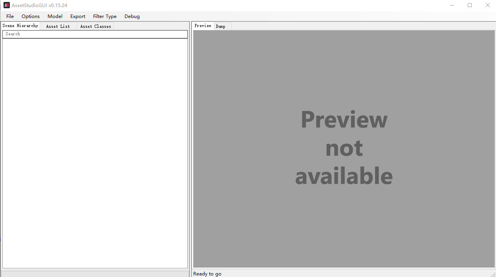
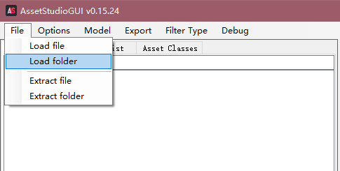
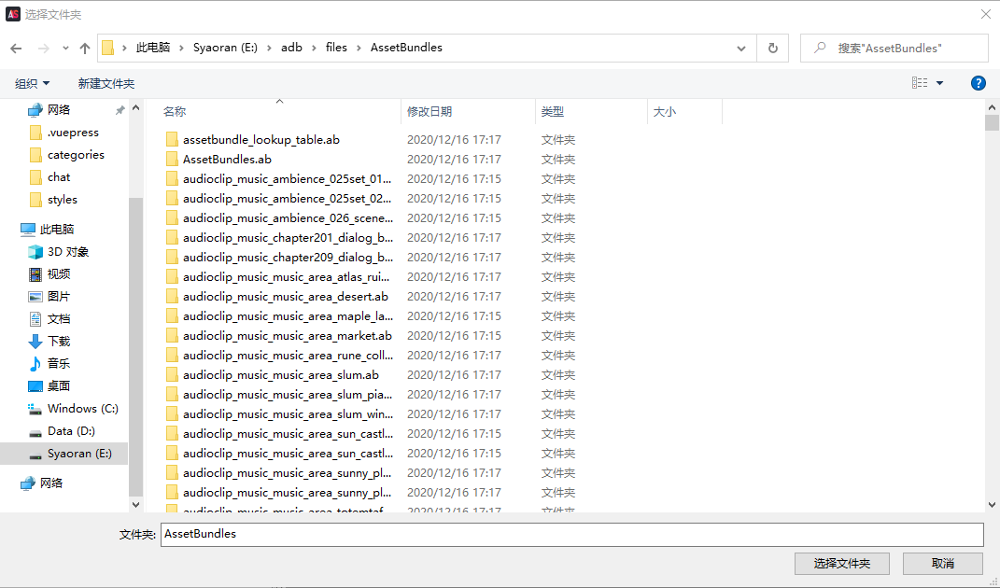
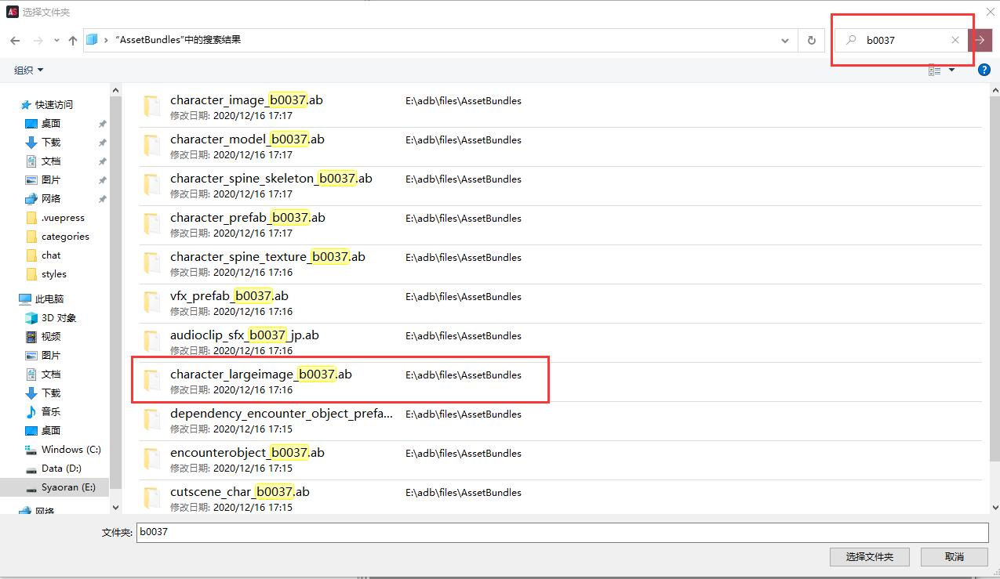
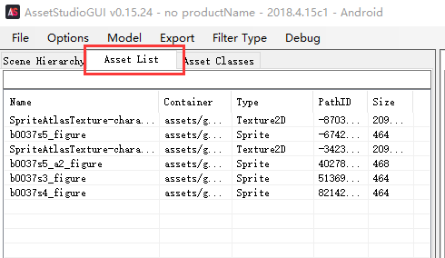
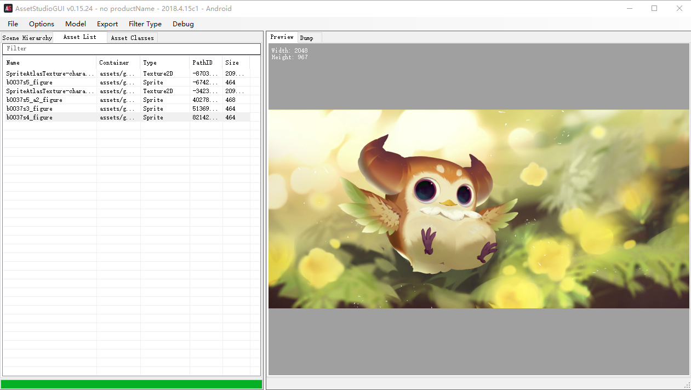
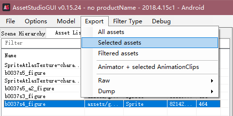
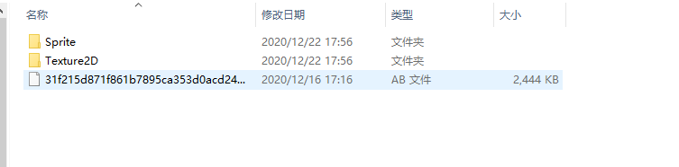
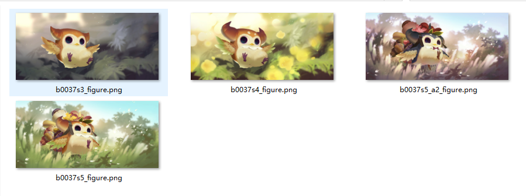

从零开始的拆包教程，主要介绍如何从游戏资源包(.ab文件)中提取想要的信息。
例如：立绘，角色头像，剧情文本

<!-- more --> 

> ***申明：**
>
> **在此申明，仅作为非商业用途的学习交流和个人记录用途，请严格遵守游戏用户协定，勿将提取的游戏资源发布到任何第三方平台。**
>
> **否则将可能造成游戏公司切实的利益损失，与一些不必要的麻烦甚者需承担相应的法律责任**
>
> **本篇不授权并禁止任何目的的分享、转载和引用，望理解**


## 介绍

从零开始的拆包教程，主要介绍如何从游戏资源包(.ab文件)中提取想要的信息。

例如：立绘，角色头像，剧情文本

本篇将从较为简单的立绘图片入手，提供保姆级别的教程。

上手难度几乎没有，据小狼说连普吉都能学会


## 准备工作

**PC电脑 （推荐Win10)**

**游戏资源包**

文件路径(安卓)：

```path
Android/data/com.ilongyuan.sdorica.longyuan/files/AssetBundles/
```

将文件夹用解压工具打包传输至电脑

解包软件：AssetStudio


## 操作流程

### 一、准备工作

不过多赘述了，没有操作难度

确保你已经安装好了上述的软件，并且将资源包解压到你想要的工作目录

### 二、熟悉软件

#### 解压后目录

找到`AssetStudioGUI.exe`


#### 双击打开软件

软件由C语言编写，官方版暂无中文支持。

不过对于万象物语我们不需要任何配置，直接使用默认的配置即可




#### 导入资产文件夹

左上角依次 File -> Load folder -> 选择界面



找到之前解压好的资产文件夹



1.使用右上角的搜索功能，输入角色的[资产编号](###资产编号)，普吉：b0037

2.单机标注[类型](###类型)的文件夹

3.然后点击按钮选择文件夹

***注意: 请确保不要未选定就直接点击，这样会导入一整个资产文件夹，并导致软件卡死，电脑爆炸(并不)**




### 三、使用软件预览

出现下面这个读条和日志，就表示你已经成功导入了


点击子栏的 `Asset List`,会发现被封包的源文件



单击其中一个预览试试

哇！鲜嫩的牛角面包出现了，快捕获它下锅！



### 四、导出文件



**选择性导出**：单选或者使用`Ctrl+鼠标左键`选择 -> Export -> Selected assets

**导出全部**：Export -> All assets

弹出目标文件夹的选择框，选择你想要存放的文件夹

默认是源文件的文件夹，导出后会自动打开目标文件夹

### 五、查看成果

至此我们已经成功地将普吉的所有立绘图片导出了(流口水





#### 其他文件用法

参考[类型](###资产编号)，方法类似

其他部分游戏也适用该教程，例如明日方舟，碧蓝航线，少女前线

## 总结

总体来说没有什么难度，该软件上手简单，简洁实用

美中不足的是不能批量导入，如果误将整个`AssetBundles`导入会使内存卡死

并且导出自定的目标文件夹地址后，下次导入文件会是该位置，而非原资源文件夹，再次选择非常麻烦


## 注释

### 资产编号

资产编号(AssetsId)程序员为简便的区分角色名称使用了形如x0000的这种编号；

琉：h0030 普吉：b0037

这个后续会专门出文章介绍，这里你可以先自己尝试一下

### 类型

介绍几个常用的类型

| 特征名称                 | 简介                   | 备注                                 |
| ------------------------ | ---------------------- | ------------------------------------ |
| character_image          | 魂册图片               | 简单,可预览                          |
| character_largeimage     | 角色立绘               | 简单,可预览                          |
| audioclip_sfx            | 角色语音音效           | 简单,可预览                          |
| cutscene_char            | 角色故事台词           | 中等，需要编码处理                   |
| character_model          | 角色配置文件           | 中等，需要编码处理, JSON格式，不易读 |
| character_spine_skeleton | 角色骨骼动画二进制文件 | 较难，模型动画配置文件               |
| character_spine_texture  | 角色骨骼动画图集       | 较难，模型动画图集文件               |
| character_prefab         | 角色模型预制文件       | 较难，Unity生成的配置文件            |
| vfx_prefab               | 特效预制文件           | 较难，Unity生成的配置文件            |