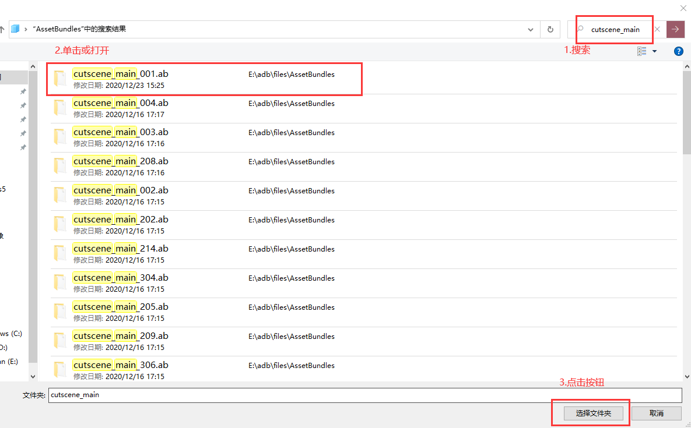
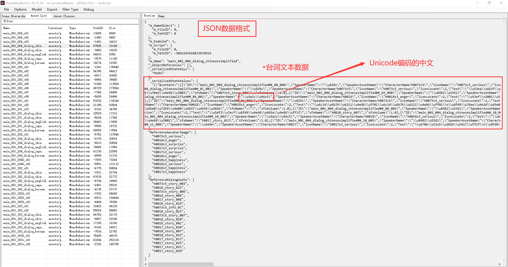
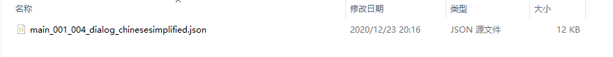
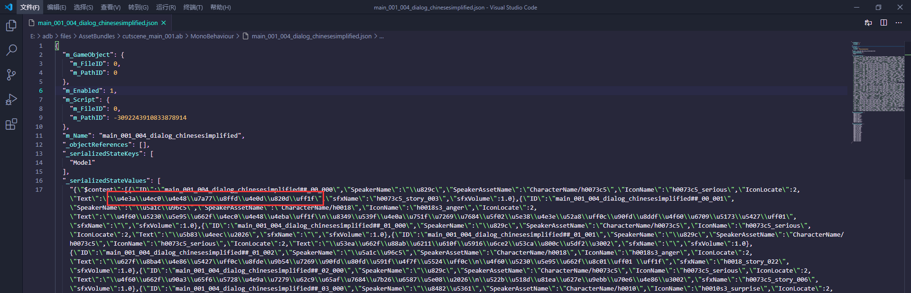
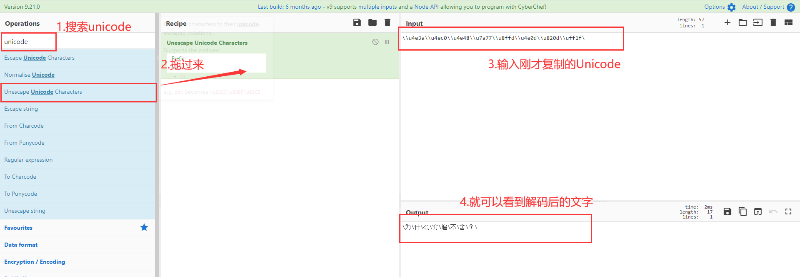
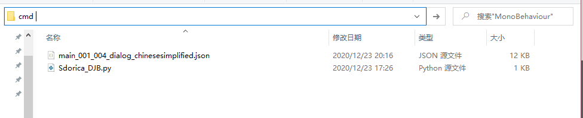
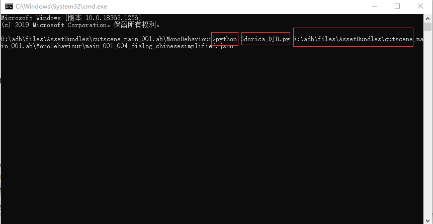
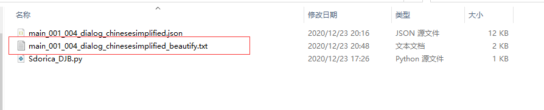
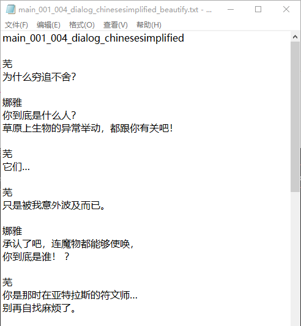

本篇主要介绍如何将**AssetStudio**导出的部分数据文件进行解码，将它从”乱码”格式转换成易于阅读的格式
将从剧情中角色台词文本入手，介绍几种常见的数据类型和编码方式

<!-- more --> 

> ***申明：**
>
> **在此申明，仅作为非商业用途的学习交流和个人记录用途，请严格遵守游戏用户协定，勿将提取的游戏资源发布到任何第三方平台。**
>
> **否则将可能造成游戏公司切实的利益损失，与一些不必要的麻烦甚者需承担相应的法律责任**
>
> **本篇不授权并禁止任何目的的分享、转载和引用，望理解**


## 介绍

本篇主要介绍如何将`AssetStudio`导出的部分数据文件进行解码，将它从”乱码”格式转换成易于阅读的格式

将从剧情中角色台词文本入手，介绍几种常见的数据类型和编码方式

难度适中，无需系统的学习过计算机编程但需要你对Python语言有较基础的认知


## 准备工作

**PC电脑**：

推荐Win10

**语言**：

Python3.7以上

自行安装和配置环境变量

**代码编辑器IDE**:

微软 VSCode (本篇推荐，具体安装方法网上有详细教学)

当然记事本(硬核老哥)也行

## 数据格式及Unicode编码介绍

### Json数据格式

一种轻量级的数据交换格式，Js对象简谱，类似Python中的字典

其特征是键值对，并且独立文件不可注释

可以充当配置文件，可以作为简易数据库，也是最常见的Http数据传输类型

**同时也是万象物语用于存储数据最常用的格式**

形如

```
"Sdorica" = {
        "键": "值",
    	"普吉" : "牛角面包",
        .....
    }
```

### Unicode编码

学过计算的朋友都应该了解，俗称”统一码”。最常见的规则便是`utf-8`

基本上有中文的地方就会出现这种格式，将中文编码成计算机喜欢的`utf-8`格式也是节约内存的手段

例如

```
\u666e\u5409
```

就是”普吉“经过编码后的

## 实战使用

### 一、解包元数据

我们还是使用`AssetStudio`进行解包具体方法参考上篇



预览一下文件



导出一个作为示例，这里导出了`main_001_004_dialog_chinesesimplified`



### 二、编码预览

我们用编辑器打开预览，复制一段Unicode去解码一下看看



这里我们使用了常用的在线解码网站[CyberChef](https://gchq.github.io/CyberChef/)进行解码

```
\\u4e3a\\u4ec0\\u4e48\\u7a77\\u8ffd\\u4e0d\\u820d\\uff1f\
```

得到结果(多余的斜杠不影响，是因为需要对`"\"`等特殊字符转义

```
\为\什\么\穷\追\不\舍\？\
```



### 三、使用Python脚本转换

这里就直接贴出代码，就是对Json库的基本运用，这里就不过多讲解了

```
#-*- coding: utf-8 -*-
# Author: Syaoran
# ClassName: Sdorica Dialogue Json Beautify

import json
import sys

file_path = sys.argv[1]

data = json.load(open(file_path,'r',encoding='utf-8'))
name = data.get('m_Name')
meta = data.get('_serializedStateValues')[0]
dialogue = json.loads(meta.replace(':.',':0.'))

dialogue_ls = []
for item in dialogue['$content']:
    speaker = item.get('SpeakerName')
    text = item.get('Text')
    dialogue_ls.append(speaker+'\n'+text)


dst_path = name + '_beautify.txt'
with open(dst_path,'w',encoding='utf-8') as f:
    f.write(name+'\n\n')
    f.write('\n\n'.join(dialogue_ls))
    f.close()
```

将代码复制粘贴保存成`Sdorica_DJB.py`，然后在文件地址栏输入cmd然后回车，进入命令行



紧接着输入 `python Sdorica_DJB.py` 然后将`main_001_004_dialog_chinesesimplified`文件拖入，然后回车即可

或者直接用 `python Sdorica_DJB.py main_001_004_dialog_chinesesimplified.json`回车，也是可以的



成功得到了生成的文本文件，打开查看一下




