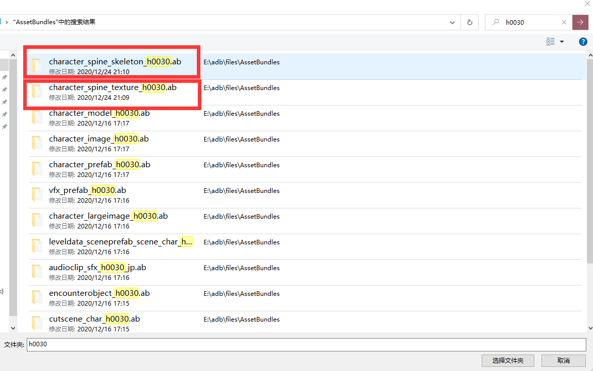
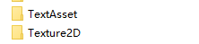
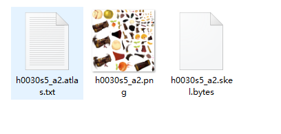
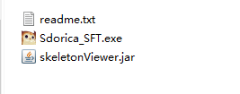
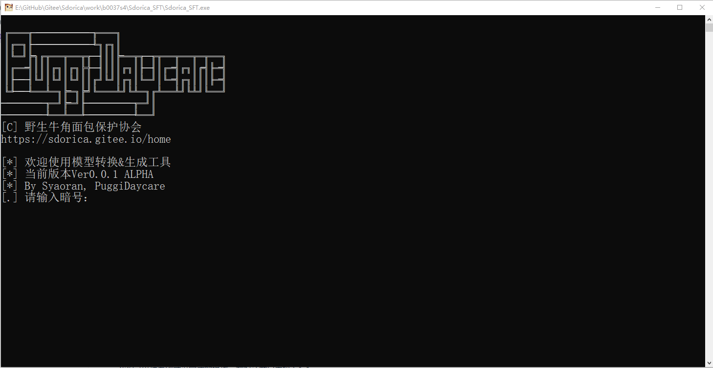
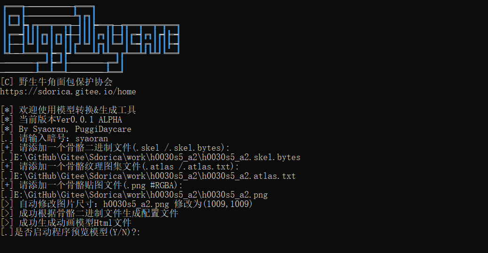
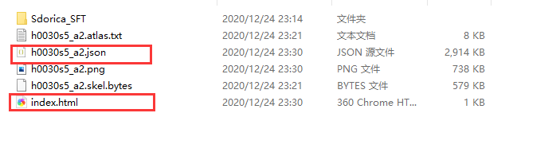
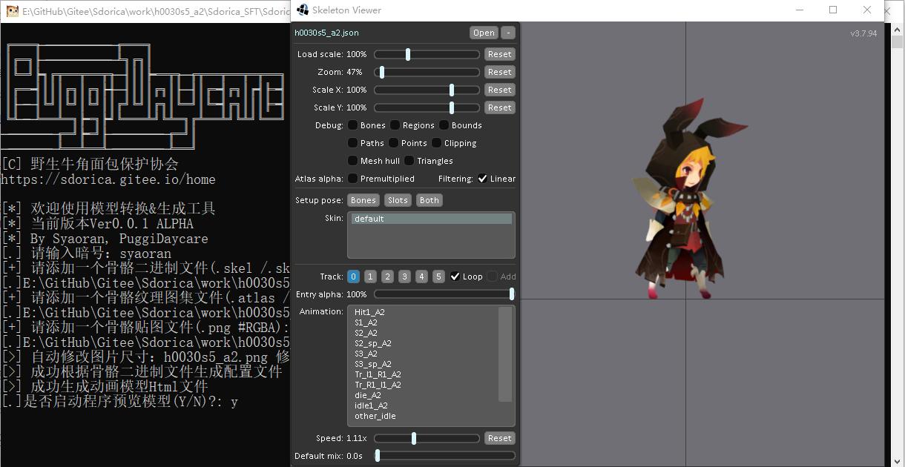

看了前面两篇文章，相信你已经能很熟练的使用AssetStudio进行资源包的解包
这次将介绍的是对万象物语小人模型的拆包和预览

<!-- more --> 

> ***申明：**
>
> **在此申明，仅作为非商业用途的学习交流和个人记录用途，请严格遵守游戏用户协定，勿将提取的游戏资源发布到任何第三方平台。**
>
> **否则将可能造成游戏公司切实的利益损失，与一些不必要的麻烦甚者需承担相应的法律责任**
>
> **本篇不授权并禁止任何目的的分享、转载和引用，望理解**


## 介绍

看了前面两篇文章，相信你已经能很熟练的使用`AssetStudio`进行资源包的解包

这次将介绍的是对万象小人模型的拆包和预览

本篇将直接介绍如何使用工具操作和预览，不需要使用到编程

## 准备工作

*注：本教程所用工具可加群获取

PC电脑(Win10)

```
AssetStudio
Sdorica_SFT工具
```

## 简单介绍

万象物语角色模型都使用的是Spine骨骼动画制作，以下简称小人模型

典型的特征就是需要三个文件来装配一个模型

| 名称     | 文件拓展名                     | 简介                   |
| -------- | ------------------------------ | ---------------------- |
| 配置文件 | `.skel` /`.skel.bytes`/`.json` | 小人模型动画的配置文件 |
| 纹理图集 | `.atlas` / `.atlas.txt`        | 小人模型贴图的配置图集 |
| 贴图     | `. png`                        | 小人模型贴图           |

本篇为了区分源文件和处理后的文件使用“老三样”和”新三样“来区分

## 使用方法

### 一、解包模型资源

使用AS对这两个文件分别解包



这里我们全部导出，分别得到两个文件夹，我们把他移动到工作目录



这里我们以`h0030s5_a2`为例，将这两个文件里的”老三样”移动到一个新的目录



### 二、使用Sdorica_SFT工具

我们得到的源文件是为游戏运行准备的，为了减少占用的内存它们都被处理过

例如：图片尺寸会被缩小，配置文件采用二进制存储

这里我们要将它们转换成运行库兼容的格式

将压缩包解压，双击启动`Sdorica_SFT.exe`

稍等半分钟加载，然后输入暗号





按照提示依次将刚才的三个文件拖入到窗口，程序会自动处理



我们可以看到在源文件的路径下生成了`h0030s5_a2.json`配置文件和`index.html`网页(本篇不用)



### 三、预览模型

首先确保你的电脑配置了Java运行环境(JRE 8+)或者Java开发环境(JDK)

`Win+R`打开运行，输入cmd，新建一个命令行窗口，输入以下命令查看是否安装

```
java --version
```


如果电脑没有安装环境，你可以到java官网下载

安装完成后再用上面的方法检测下是否有了环境变量


我们可以接着刚才没完成的操作，在对话窗口中输入”y”

就会调用`SkeletonViewer`播放器查看模型



如果想下次再用这个播放器,使用CMD在命令行输入以下命令即可

```sh
java -jar skeletonViewer.jar
```
