万象物语模型全工具介绍，看这一篇基本够了(最后更新于: 2021-3-11)

<!-- more --> 

> ***申明：**
>
> **在此申明，仅作为非商业用途的学习交流和个人记录用途，请严格遵守游戏用户协定，勿将提取的游戏资源发布到任何第三方平台。**
>
> **否则将可能造成游戏公司切实的利益损失，与一些不必要的麻烦甚者需承担相应的法律责任**
>
> **本篇不授权并禁止任何目的的分享、转载和引用，望理解**


## 介绍

万象物语的动画模型采用了Spine3.2.01版本制作，并且解包获取的配置文件是`.skel`二进制文件

因其不向下兼容特性，以及很多运行库不支持二进制文件的解读

所以在尝试了很多工具后，大致总结了下面的概览表


| 名称                 | 别称/俗称   | 类型/版本            | 推荐度 |
| -------------------- | ----------- | -------------------- | ------ |
| Spine Pro            | 骨骼编辑器  | 全                   | 不推荐 |
| Spine Trial          | 骨骼编辑器  | 默认最新版(或破解版) | 不推荐 |
| **SkeletonViewer**   | 骨骼预览    | 3.5+                 | 推荐   |
| **Spine_web_player** | 网页播放器  | 3.5+                 | 推荐   |
| DragonBonesPro       | 龙骨编辑器  | 3.1                  | 失败   |
| **Live2dViewerEX**   | l2dex-spine | 较全(兼容万象)       | 推荐   |
| Unity                | Spine-unity | 较全(兼容万象)       | 不推荐 |
| **SpineViewerWPF**   | -           | 较全(兼容万象)       | 推荐   |
| **SuperSpineViewer** | -           | 较全(兼容万象)       | 推荐   |

阅读本篇可以先查看[术语表](https://sdorica.gitee.io/blog/教程/spine01/#术语)

## Spine 骨骼动画编辑器

### 推荐指数

考虑对于非开发人员的性价比，不推荐

优点：官方正版，完美导入导出，版本升级和回调；

缺点：需要购买个人专业版(太贵

### 专业版 Pro

当下游戏使用最多的动画模型制作软件，例如：万象物语，明日方舟，崩坏系列，少女前线，碧蓝航线等

非专业开发人士不推荐购买专业版使用

### 试用版

默认最新版，无法使用

### 学习版

神秘人提供的破解版，版本固定无法回退

### 纹理图打包/解包

无论哪一种都能使用该功能，当然我也使用Python脚本复刻了该功能用于二创

## SkeletonViewer 骨骼动画播放器

### 推荐指数

9.5/10 强烈推荐

### 介绍

使用Java基于`spine-libgdx`运行库编写，用于快捷预览骨骼动画的播放器，拥有一些简单的功能

## Spine Web Player 网页播放器

### 推荐指数

9/10 强烈推荐

### 介绍

使用Typescript基于`spine-ts`运行库编写，用于多端预览骨骼动画的网页播放器，功能类似`SkeletonViewer`

### Gitee部署

因为新版本的js脚本不支持对本地文件的调用，所以需要在服务端部署查看

如果你有服务器可以直接将“新三样”加生成的html文件放在网页同一目录下使用

如果没有服务器可以使用Github或者Gitee提供的Page服务部署

这里我们Gitee为例演示如何快速部署一个网页

你需要了解[Git](http://git-scm.com/downloads)的简单使用方法

### 步骤

一、安装git和注册Gitee

[推荐文章](https://blog.csdn.net/m0_47740092/article/details/108181658)

[廖雪峰教程](https://www.liaoxuefeng.com/wiki/896043488029600/1163625339727712)

二、创建gitee码仓

名称介绍随意填写，开源设成公开，然后点创建即可

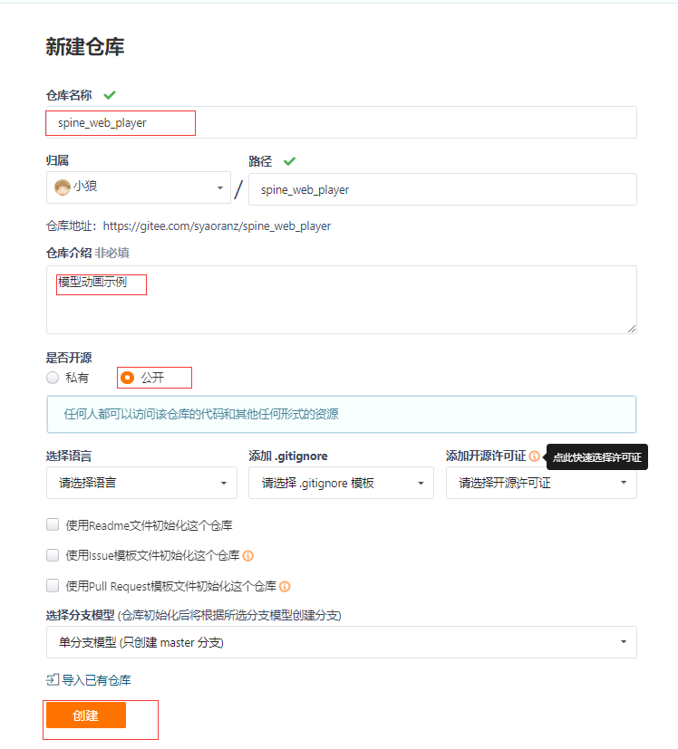

三、将Sdorica_SFT生成的文件移动到一个新建的文件夹

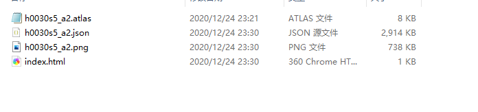

四、使用git上传远程码仓

该文件夹下右键打开选单，新建一个bash

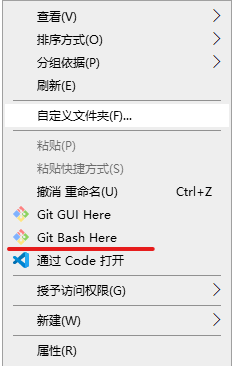

```
#如果执行过这个直接跳过
git config --global user.name "Your Name"
git config --global user.email "email@example.com"

#依次执行
git init
git add .
git commit -m "init."
git remote add origin https://gitee.com/syaoranz/spine_web_player.git #这里替换你自己的码仓地址
git push -u origin master
```

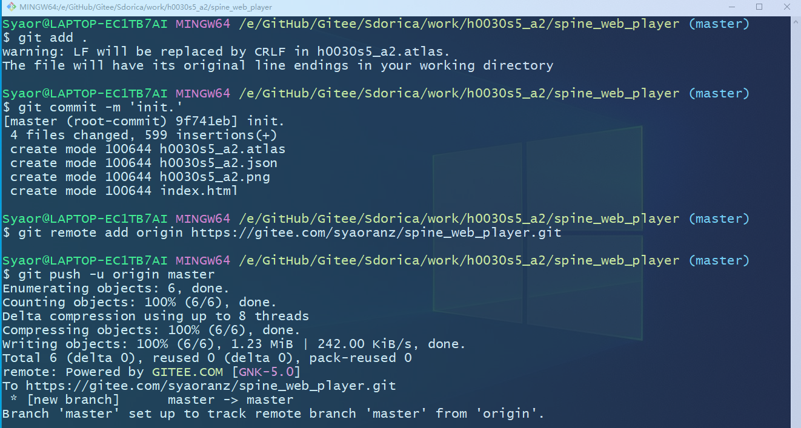

五、回到码仓页面进行部署

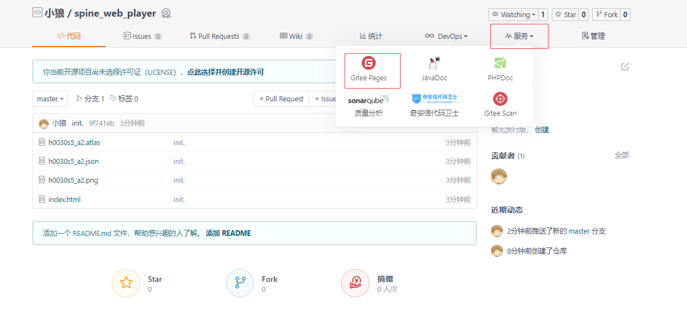

勾选强制https，然后启动。等待部署完成即可

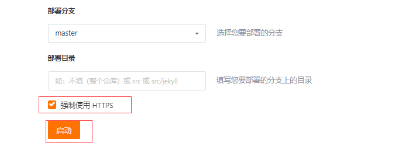

六、点击部署好的网站查看


大功告成了

## DragonBonesPro 龙骨动画编辑器

**该方法失败，如果你有更好的想法可以联系作者**

### 介绍

国产白鹭(Egret)科技旗下的制作动画模型的软件，开源免费，提供多平台支持，并且功能多样

国产游戏使用较多的动画模型软件

### 初次尝试

安装好后我们尝试导入一下“新三样”

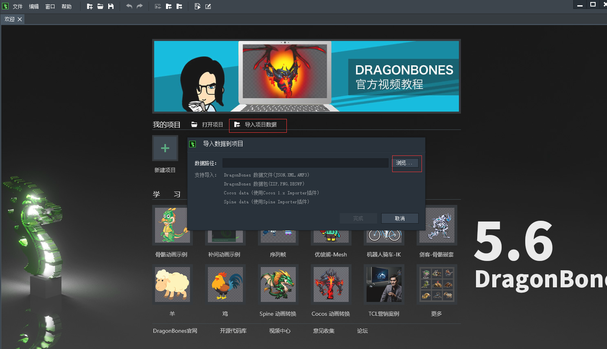

进入选择文件界面，我们要选择`.json`配置文件，软件会自动匹配到其他两个文件

**注意：新三样的`.atlas.txt`文件需要去掉后缀`.txt`，并且名称一致，才能自动识别**

插件选择Spine data,单击完成

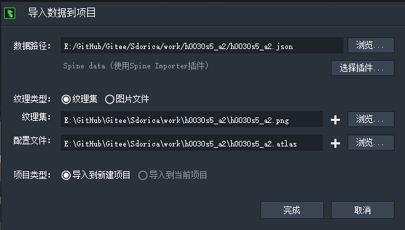

我们会发现除了电脑卡了一下，并没有什么反应，多次尝试还是失败了

更换其他角色部分成功，但是模型无法正常显示

### 问题分析

推测可能是json配置文件的版本(3.7)和龙骨的插件SDK(3.1)不兼容

寻找适合的插件或者将配置文件转换成龙骨专用的json文件

#### 更换插件

未找到官方提供的Spine其他版本插件

#### 手动修改原本的json配置文件

尝试修改配置文件

修改表头会报错无法导入

删掉动画参数，角色模型仍然是崩的

所以不再尝试了，感兴趣的朋友可以参考[这篇](https://www.bilibili.com/read/cv4508833/)

#### 使用官方提供得转换工具

按照[龙骨官方工具文档](https://github.com/DragonBones/Tools/blob/master/README-zh_CN.md)操作，先安装NodeJs，然后安装工具

新建一个命令行窗口输入`2db --help` 查看环境是否安装上了

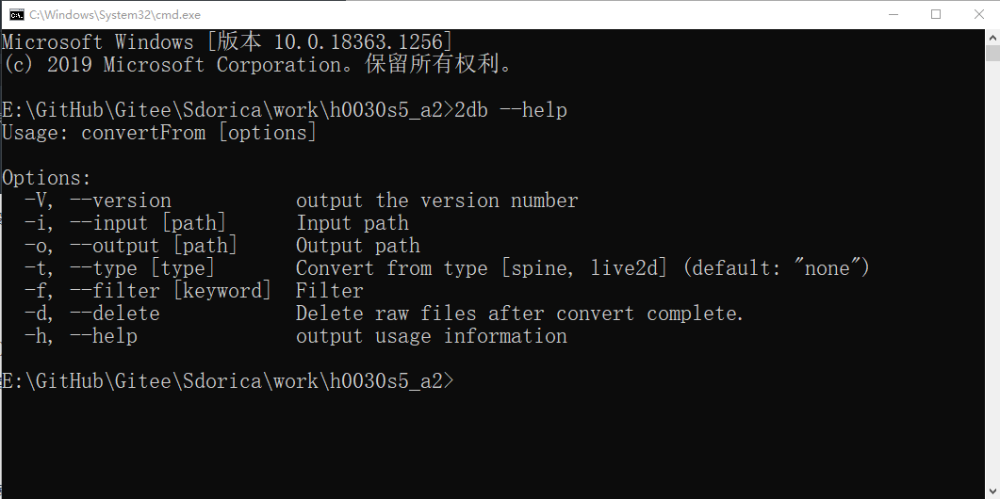

在新三样的目录下，我们先把原先的json文件复制到一个新建的文件夹，然后在新的里面使用命令

等待了相当长的时间，因为见不到报错和运行日志所以我放弃了

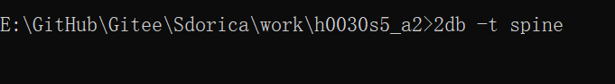

### 失败告终

尝试了各种方法，均不能完美导入。

现在只能等待龙骨推出支持的Spine版本了

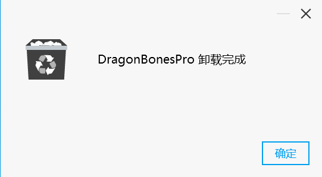

## Live2dViewerEX(DLC-Spine) 桌宠壁纸软件

### 推荐指数

10/10

### 介绍

由C语言基于`Spine-c`运行库编写的拓展插件，支持对spine动画的读取，预览，自定义动作组等功能

steam商店[链接](https://store.steampowered.com/app/616720/Live2DViewerEX/)(本体+拓展=26+9=35 CNY)

这款软件是我觉得最适合想自己玩赏角色模型的玩家使用的，优点实在太多了，简单说几点

- 无需任何操作处理，可以直接将解包得到的“老三样”导入并预览
- 支持自定义动作组，点击触摸触发动作或文字弹框
- 无上手难度，不需要编程基础
- 可以把自己编辑的模型当桌宠，也可以上传至创意工坊

缺点是付费，暂不支持网页版（询问后得知有测试版WebGL)


### 教程

[官方教学视频](https://www.bilibili.com/video/BV1vV411k7kZ)

## SuperSpineViewer

### 介绍

Java编写的基`于Spine-libgdx`运行库，界面简洁，功能多样

支持导出序列帧图以及视频(需要ffmpeg环境支持)

### 推荐指数

推荐

教程：https://www.taptap.com/topic/16434701

码仓地址: https://github.com/Aloento/SuperSpineViewer

## SpineViewerWPF

### 介绍

有Java编写的基`于Spine-C#`运行库编写，功能全面，支持导出动图和视频

需要注意安装依赖运行

### 推荐指数

推荐

项目地址: https://github.com/kiletw/SpineViewerWPF

## Spine-Unity 运行库

### 介绍

因为游戏就是Unity引擎开发的，所以是肯定支持的

但由于要下载的运行库文件太大，所以我没有亲自尝试

[官方中文文档](http://zh.esotericsoftware.com/spine-unity)

### 推荐指数

不推荐

## 术语

### 骨骼动画 Spine

释义骨骼，常见的动画模型编辑软件。模型具有互相连接的“骨骼”组成的骨架结构，通过改变骨骼的朝向和位置来为模型生成动画。

### 版本回退/升级 Rollback/Upgrade

**回退**：将最新版本的配置文件降低到低版本，例如：4.0 -> 3.7 or 2.1

**升级**：

Spine的配置文件没有向下兼容的特性

所以只能使用专业版或者自己编写脚本将低版本的配置文件转换成高版本

例如：3.2 -> 3.7

### 模型配置文件

**Json格式文件**：模型的总体配置文件，控制模型的贴图，皮肤，插槽，动画等

**Skel二进制文件**：同json格式文件，但被特殊处理成二进制文件以减少占用的内存

**Atlas文件**： 贴图的配置文件，根据它可将贴图拆分下来

### 运行库 Runtime

不同语言设计的程序运行时动态调用的属性、类、方法等

### 贴图/纹理图 Atlas

Spine模型的贴片图，俗称”碎尸图”

### 小人模型 chibi

对Spine动画模型的俗称

### 老三样/新三样

老三样就是通过解包获得的三个源文件

```
.skel.bytes/.atlas.txt/.png
```

新三样就是通过转换新获得的三个模型文件

```
.json/.atlas.txt/.png
```

### 序列帧

序列帧是把活动视频用一帧一帧的图像文件来表示

常见的动画帧数设置为25、30FPS

即: 每秒25(30)张图片
