前面已经详细介绍了模型动画的工具，这次带来的教程是对模型动画的二次创作。

对游戏角色的部分部位进行修改或添加新部件，以实现一个新模型的创作

同时希望你看完这篇文章也能加入我们来创造更多有意思的作品

<!-- more --> 

> ***申明：**
>
> **在此申明，仅作为非商业用途的学习交流和个人记录用途，请严格遵守游戏用户协定，勿将提取的游戏资源发布到任何第三方平台。**
>
> **否则将可能造成游戏公司切实的利益损失，与一些不必要的麻烦甚者需承担相应的法律责任**
>
> **本篇不授权并禁止任何目的的分享、转载和引用，望理解**


## 介绍

前面已经详细介绍了模型动画的工具，这次带来的教程是对模型动画的二次创作。

对游戏角色的部分部位进行修改或添加新部件，以实现一个新模型的创作

同时希望你看完这篇文章也能加入我们来创造更多有意思的作品

举个生动直观的例子如下，看完这篇你也能自行实现这种效果


面具小德 (By [龙龍龖龘](https://space.bilibili.com/319482625))

## 纹理图处理

就像上面对面具小德的处理一样，我们需要将面具换成海德脸

那么就需要将部件取下来单独进行处理，然后再完整的打包成一张纹理贴图

这里我们可以使用一些工具

### 使用Spine

打开任意版本的Spine，然后选择纹理解包器

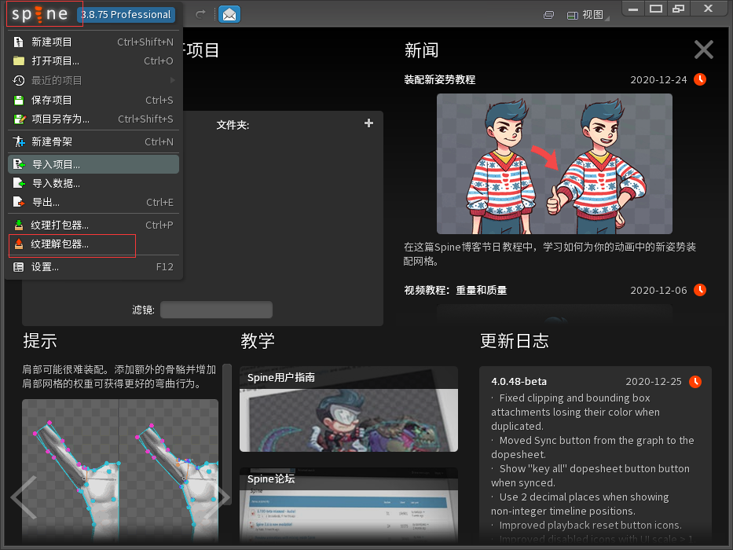

选择你要处理角色的`.atlas`图集配置文件,请确保有同名的Png角色贴图在同一目录下

例如：`h0164s5.atlas.txt/h0164s5.png`

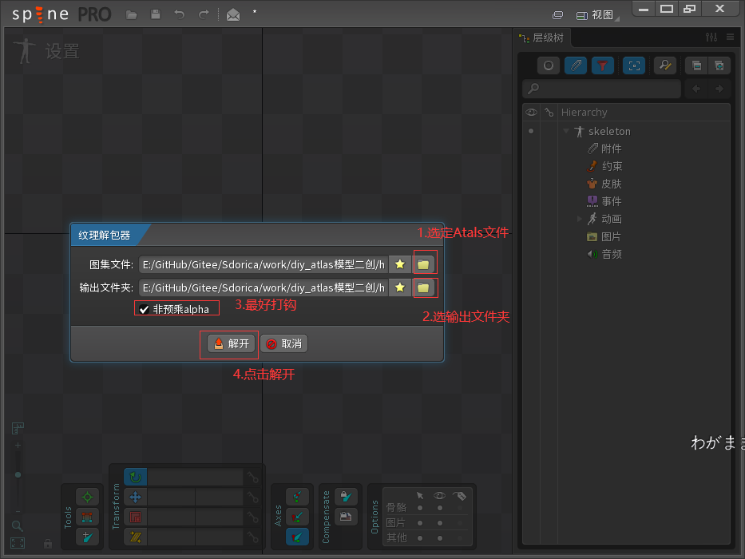

查看解包获得到的拆分图集，我们将`mask.png`面具拿去P图

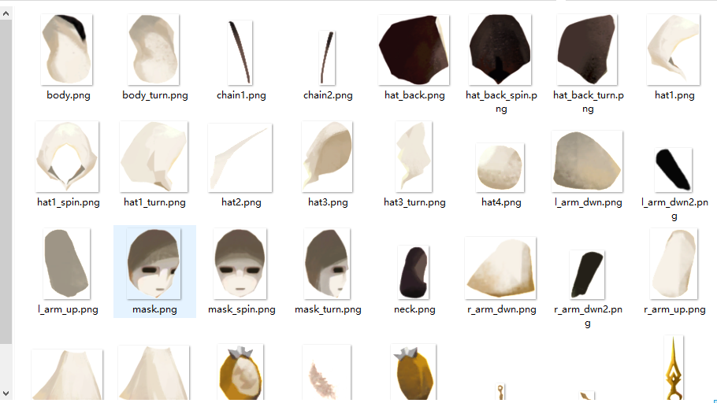

此处跳过P图过程，将海德面具替换原来的`mask.png`

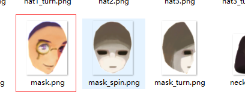

再次打开Spine,找到纹理打包器

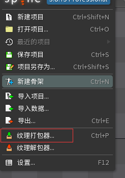

选定刚才的拆分图的文件夹

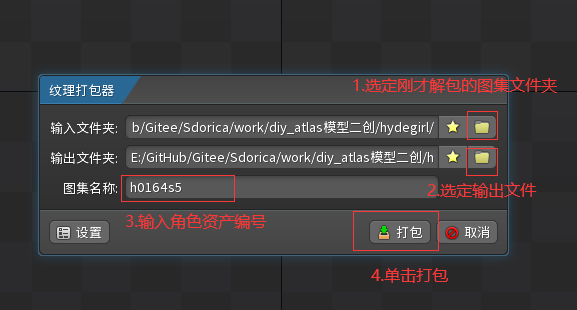

Spine为我们重新打包了画框的两个文件，我们把Sdorica_SFT工具生成的文件也复制到这个目录

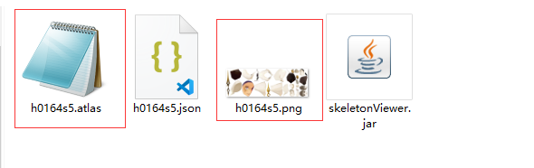

我们双击使用`SkeletonViewer`查看模型

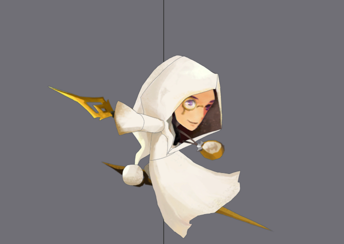

值得注意的一点是，我们使用这个方法进行部位修改，可以**无需对图片尺寸修改**。

因为是重新打包，所以不需要将图片尺寸修改到和原来一样，但是图像的**相对位置要正确**

### 使用Python脚本

[码仓工具代码](https://gitee.com/sdorica/spine_atlas_chef)

按照使用说明操作，可以代替Spine的解包/打包功能

要注意，因为是对原有图集进行打包，而非重新自建打包

所以你需要在打包之前使用脚本的功能进行图片尺寸的修正

## 导出动图

### Spine

使用Spine官方提供的导出支持

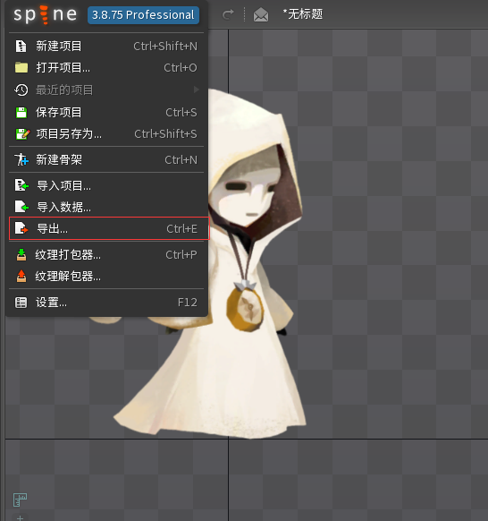

你可以选择直接导出gif，也可以选择导出序列帧图

帧数一般选择25

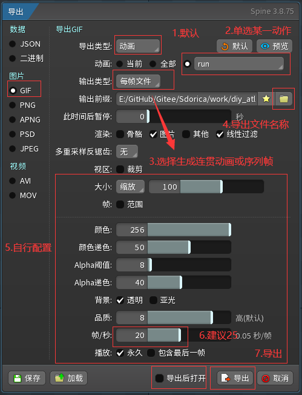

### naganeko.github.io

[官方主页](https://naganeko.github.io/) 需要代理

小人模型在线工具

**功能强大**

- 可以预览模型动画(.JSON)
- 生成序列帧图并打包
- 生成动态图GIF/APNG
- 向模型额外添加装饰部件

后面会专门写一篇适用于万象物语文章介绍详细功能

### SpineViewerWPF

[项目地址](https://github.com/kiletw/SpineViewerWPF)

使用的是`spine-csharp`运行库编写

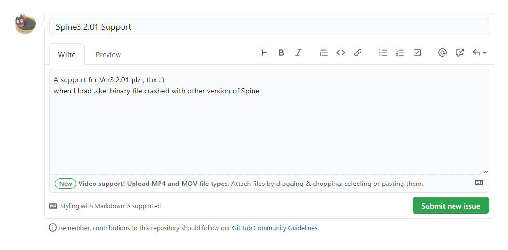

经过Issue后，作者大佬添加了万象的对应版本可以下载使用

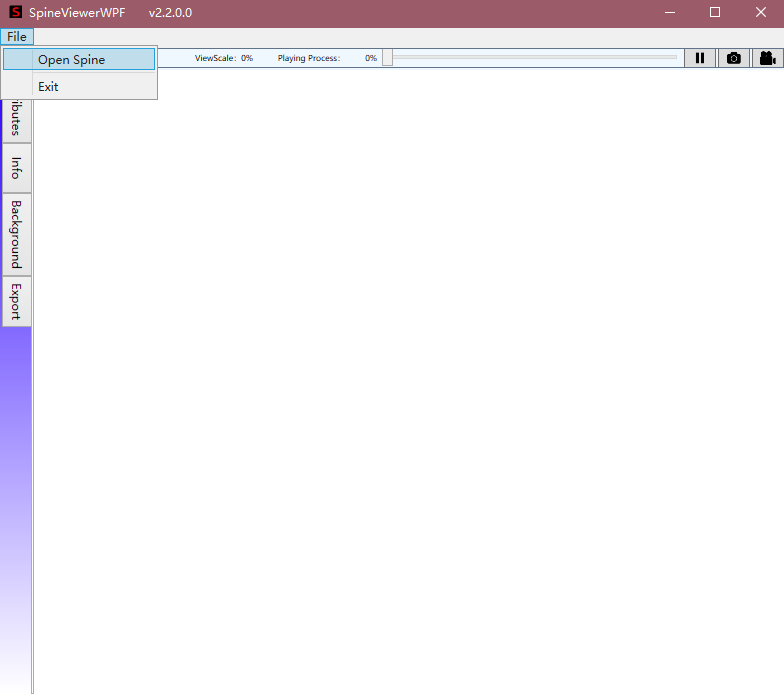

#### 使用说明

##### 准备

将Assets Studio导出的文件重名为以下后缀的文件：
.skel
.atlas
.png

##### 导入

File -> Open Spine -> 选择文件路径 -> Spine Version 3.2.xx -> open

##### 选择动作

左侧栏-> Attributes -> Anime -> 勾选IsLoop查看

##### 导出PNG

等待想要的帧出现后，点击右上角暂停。然后再点击旁边的小相机
选择需要导出的目标路径

##### 导出GIF

点击右上角录像机，等待一会，会弹出选择目标路径

##### 万象默认选项

Spine version: 3.2.xx

##### 程序崩溃

可能会造成崩溃的操作

- 选择错误的版本
- 导出动画

### SkeletonExporter

[项目地址](https://github.com/ssz66666/spine-skeleton-exporter) 在release里下载jar包

使用方法

```
java -jar skeletonexporter.jar -i [json配置文件] -d [输出文件夹] --ffmpeg [可执行文件地址(.exe)]
```

根据json文件将模型动画，导出为`.mp4`和`.png`(单帧)

**不推荐**使用，参数添加比较复杂，需要ffmpeg

对万象角色导出的效果一般，角色有描边，剪裁不均，视频是灰底

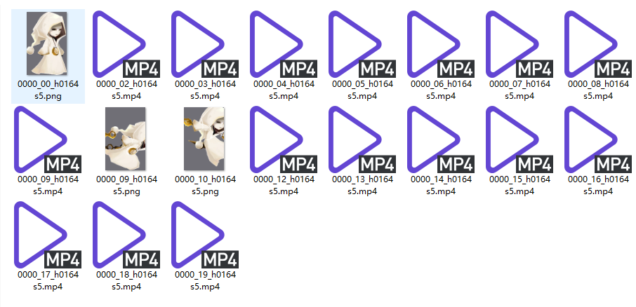
