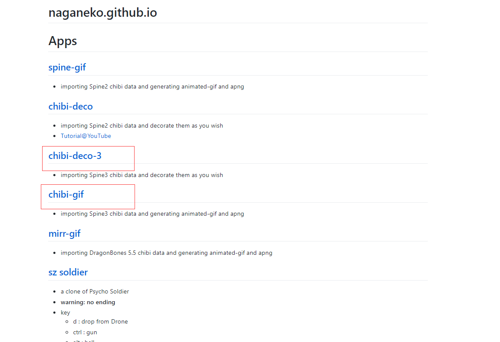
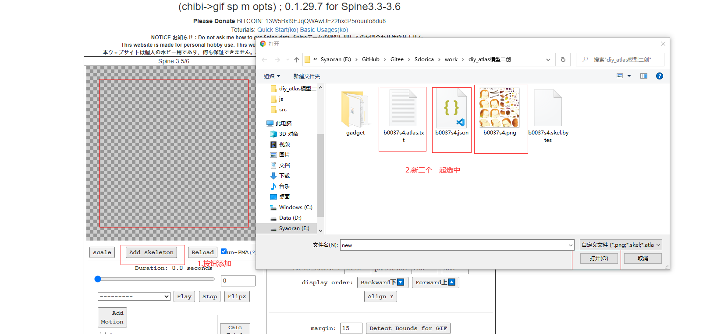
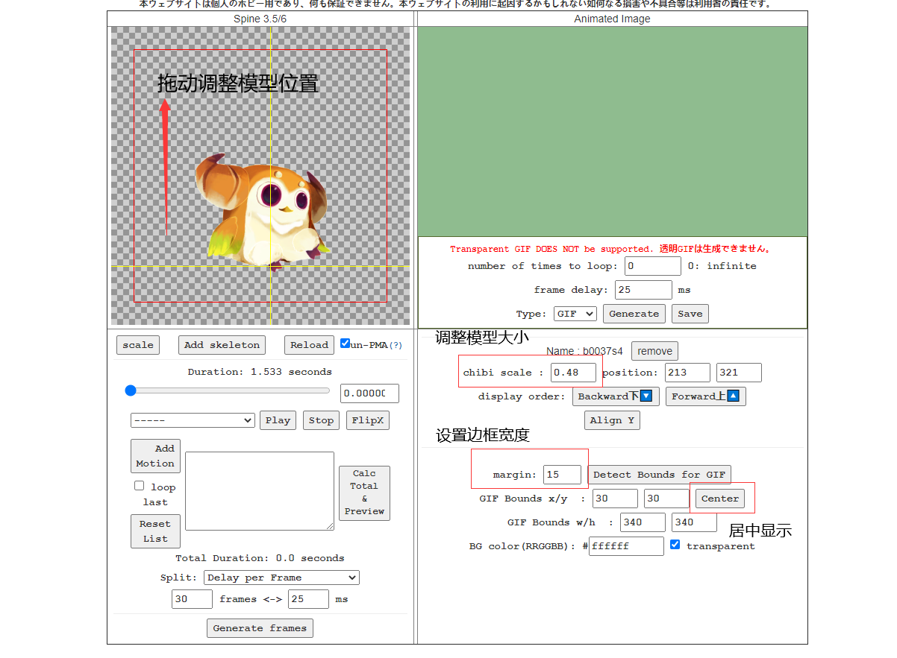
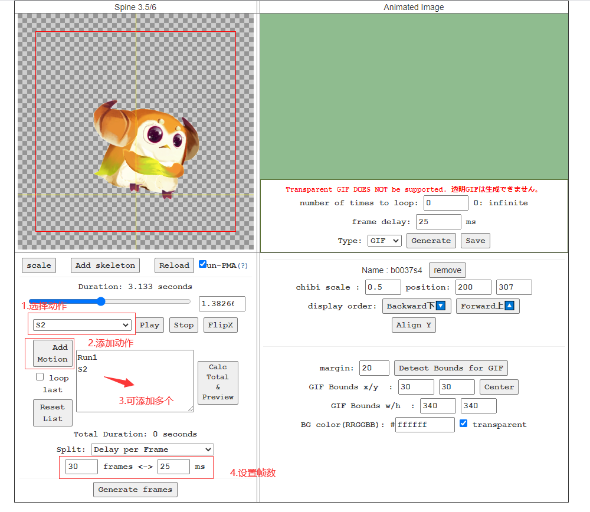
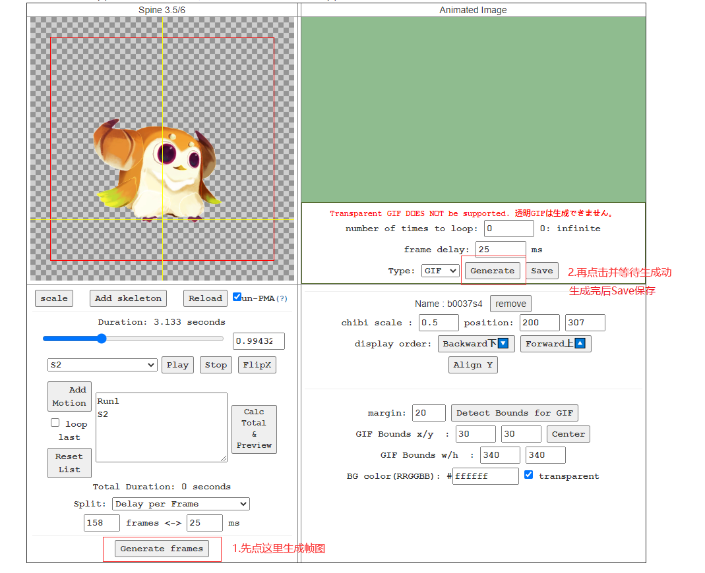
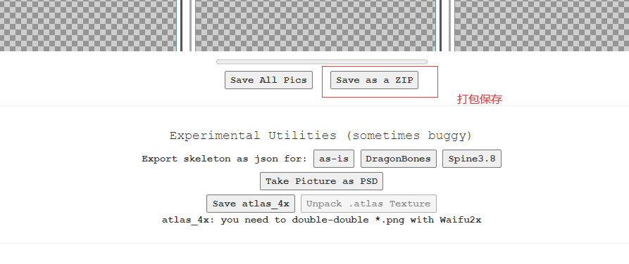
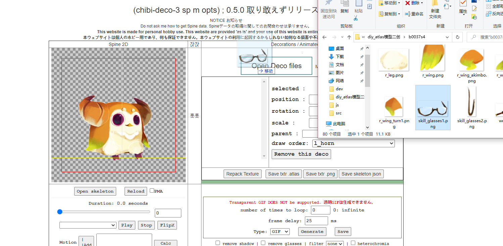
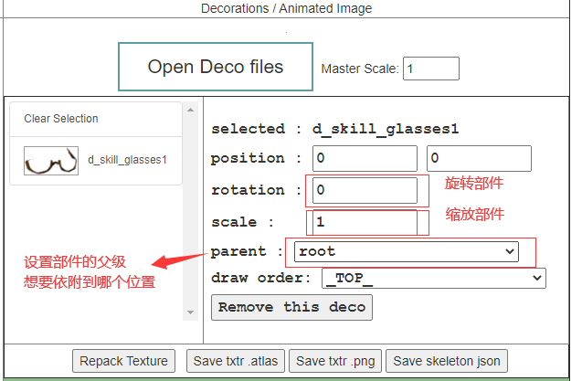
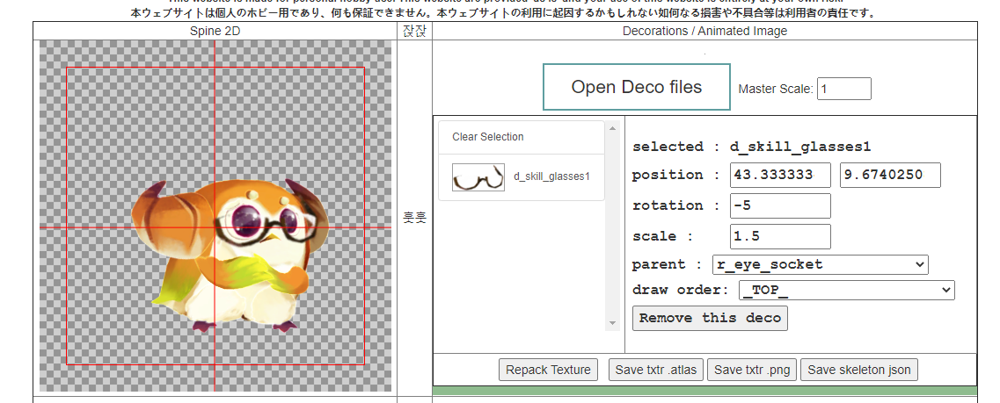

本篇讲解如何使用一个非常nice的网页在线工具

可以用于模型的查看，以及导出gif/png图片

<!-- more --> 

> ***申明：**
>
> **在此申明，仅作为非商业用途的学习交流和个人记录用途，请严格遵守游戏用户协定，勿将提取的游戏资源发布到任何第三方平台。**
>
> **否则将可能造成游戏公司切实的利益损失，与一些不必要的麻烦甚者需承担相应的法律责任**
>
> **本篇不授权并禁止任何目的的分享、转载和引用，望理解**


## 介绍

本篇讲解如何使用一个非常nice的网页在线工具

[官方主页](https://naganeko.github.io/) 作者[Twitter](https://twitter.com/lazy_schemer)

可以用于模型的查看，以及导出gif/png图片



## 制作GIF及帧图

### 简述

```
Chibi-gif
```

通过导入“新三样”，进行动画选择和缩放等操作，生成序列帧图和生成GIF/APNG

### 操作流程

#### 一、导入文件



#### 二、调整模型

拖动以调整模型位置，更改模型大小，以及边框宽度



#### 三、配置动作组



#### 四、导出动图





## 添加装饰部件

### 简述

```
Chibi-deco
```

通过导入“新三样”，添加自定义的Png贴图，绑定骨骼以实现添加装饰部件

镜像网站暂时不能生成帧图和GIF

### 操作流程

#### 一、导入文件

同上，将老三样导入

#### 二、导入装饰部件

将想要添加的自定义贴图拖动到`Open Deco files`的识别区域



#### 三、配置装饰部件





#### 四、导出新三样


依次点击这四个按钮

第一个是生成纹理图集，后面三个下载新三样

**注意：下载出来的文件不能直接使用，是因为Atlas文件里的贴图名称会和生成图片的名称不符**

需要将文件名还原，例如：`b0037s4_deco.xxx -> b0037s4.xxx`

再导入到相关软件使用
